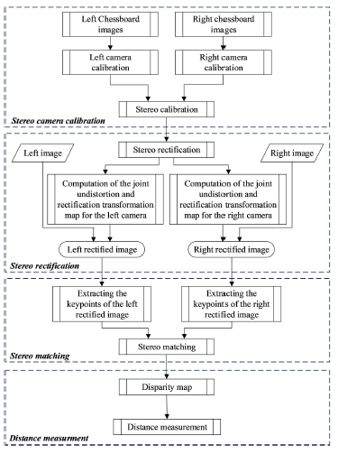
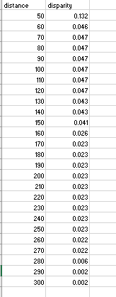
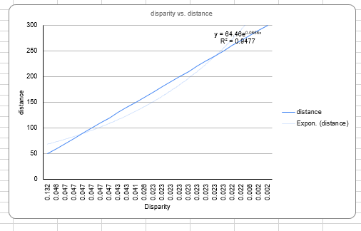
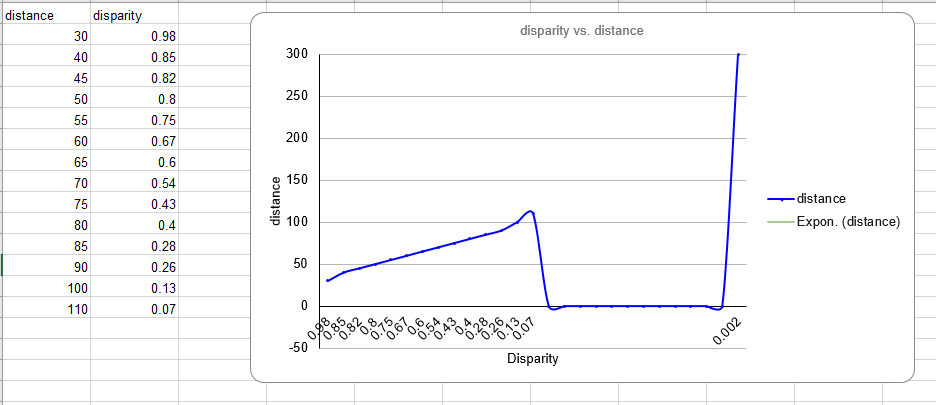
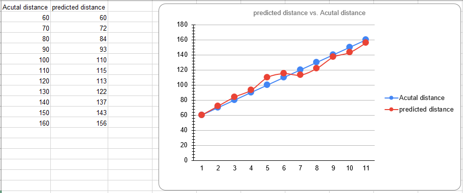

### Passive Stereo Camera Distance Measurement

"The use of passive stereo camera to reconstruct depth for a very large distance application"

**Setup** </br>
1. Install Python 3.10 and Packages
```shell
pip install -r requirements.txt
```

**How to run the code using PyCharm?** </br>
Open the terminal on PyCharm 

2. Active Camera and Take images from both cameras 
```shell
python take_images.py
```
3. Calculate the distance and disparity 
```shell
python stereo_vision.py
```
4. Calculate the disparity 
```shell
python stereo_vision.py
```

### Key Paper Proposed Approach 
All the given steps followed from the key-paper to perform the proposed approach.
Following key-points are mentioned below and whole model divided into the milestones.

 

### Milestone 1
The first milestone contains the following points:
1. Arrange a dataset to test the model, (left-side camera, right-side camera images of the objects)
2. There are no public datasets available. So, we have created the dataset for testing 
the model we will be using in this project. Chessboard used to capture their left and right camera images.
3. Data Pre-processing (remove noise, enhance images, and prepare images for model)
4. Two cameras set for the stereo calibration (Logitech C270 Webcams) 
5. Calibration code added in which first it reads the images and gives calibration matrix
6. A GitHub repo is created where these data and descriptions uploaded for version control
7. Performed multiple options to set the stereo calibration 

Here are the camera settings for this dataset acquisition: 

**Camera Specification** </br>
*Logitech C270 WebCameras* </br>
These cameras have some specification:
**Dimensions including fixed mounting clip**
- Height: 2.87 in (72.91 mm)
- Width: 1.26 in (31.91 mm)
- Depth: 2.62 in (66.64 mm)
- Cable length: 5 ft (1.5 m)
- Weight: 2.65 oz (75 g)
  
**Camera Technical Specifications**
- Max Resolution: 720p/30fps
- Camera megapixel: 0.9
- Focus type: fixed focus
- Built-in mic: Mono
- Mic range: Up to 3 ft (1 m)
- The diagonal field of view (dFoV): 55°
- Universal mounting clip fits laptops, LCDs or monitors


### Milestone 2
The second milestone contains the following points:
1. Input the left image (left cam) and right image (right cam)
2. Stereo Rectification performed 
3. Logistic regression applied in the model and get best results 
4. Machine Learning (More algorithms are In-Progress)
5. Deep Learning Algorithms Training (In-Progress)
6. Obtained the left rectified and right rectified images 
7. Parameters for Distortion Calibration


### Milestone 3
- Stereo Matching
- Distance Measurement
- Model Evaluation


### Novelty Updates
Suggest to improve by the following points:

- Processing time reduced (it's realtime distance calculation)
- New algorithm used (polynomial regression)
- Tune the algorithm's parameters(Done)
- Any change as compared to the key paper(Key paper uses simple formula to calculate the distance using z = f*B/d, but in our approach we are using polynomial regression of order 3 based on disparity)

**Test 1**

**Disparity vs Distance results**



Graphical Representation 



**Test 2**

**Dataset**



**Proposed Model Prediction**



#### Supporting material 
- [Single Cam Distance Measurement](https://github.com/Asadullah-Dal17/Distance_measurement_using_single_camera/tree/main ) </br>
- [Stereo Calibration](https://github.com/TemugeB/python_stereo_camera_calibrate)
